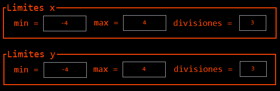

  
 # INSTITUTO POLITECNICO NACIONAL 
 ### Unidad Profesional Interdisciplinaria en Ingeniería y Tecnologías Avanzadas
---
---

## Practica 3 - Calculo de Volumen de Funciones 
### Cruz Beltrán Christian Arduel
#### Cálculo Vectorial - 1MM5

# Contenido
- [Introduccion](#Introducción)
- [Uso del GUIDE](#Uso-del-GUIDE)

    - [Función](#Función)
    - [Limites](#Limites)    
    - [Graficar](#Gráficar)
    - [Plots (Graficos)](#Gráficos)
    - [Datos de la región](#Datos-de-le-región)
    - [Navegación entre regiones](#Regiones)
    - [Volumen](#Volumen)

- [v1.0.0](#v1.0.1)
- [v1.3.0](#v1.3.1)

# Introducción
La finalidad de esta práctica es facilitar el cálculo de volumen para funciones en el espacio del tipo **F(x,y)**, esto es posible gracias a la siguiente formula:

El método consiste en dividir una región del espacio en varias regiones que nos permitan delimitar puntos dentro de ellas.

Una vez que tenemos las dividiones tenemos que tomar la diferencia de la region formada por las divisiones de x y y, con eso calculamos el área de esa pequeña región y dentro de cada región elegiremos un punto P(x,y) que evaluaremos en la función F(x,y) lo cual nos devolvera la altura que existe de ese punto a la función, la altura junto con el área de la región nos devuelve un volumen para esa pequeña región.

Repitiendo el procedimiento para cada región que se requiera, obtendremos pequeños volumenes, lo que nos dará un valor aproximado del volumen que existe debajo de la función.

***NOTA: Para obtener un valor más acertado, las divisiones para x y y deben ser muchas, con el fin de obtener volumenes rectangulares más pequeños pero más cercanos a la función.***

[Volver](#Contenido)

# Uso del GUIDE
En este apartado veremos las caracteristicas que se encuentran en el GUIDE y la funcionalidad que tiene.
***
##  Función

En este campo introduciremos la función **F(x,y)** que queremos analizar y calcular su volumen.

Es importante que al momento de escribir la ecuación se haga de la manera apropiada, es decir, usando la notación de *Matlab*.

[Volver](#Contenido)
***
##  Limites

Dentro de estas casillas iran los limites de evaluación correspondientes para cada eje (x, y), cada casilla debe ser llenada para que el GUIDE funcione de manera correcta.

Las casillas de divisiones corresponden a las veces en que los ejes se van a dividir para la creación de las pequeñas regiones, como se menciono anteriormente **para un cálculo con mayor precisión estas divisiones deben ser bastantes pero se tiene que considerar que a mayor numero de divisiones, los cálculos requerirán mayor tiempo de ejecucion**.

- min -> Valor minimo del eje x y y respectivamente.
- max -> Valor maximo del eje x y y respectivamente.
- min -> Divisiones del eje x y y respectivamente.

***NOTA: Todos los valores deben ser números enteros***

[Volver](#Contenido)
***
##  Gráficar

Una vez que los campos de la [función](#Función) y los [limites](#Limites) están llenados correctamente, podemos presionar el botón de **Gráficar** para que el GUIDE realice los cálculos y nos muestre la [gráfica de la función](#Gráficos), [las regiones](#Navegación-entre-regiones), los puntos muestra, curvas de nivel, [el área de la región](#Datos-de-la-región) y finalmente lo que nos interesa el [volumen](#Volumen) de la función.

Con el botón **Limpiar** limpiamos todos los campos y se deja como cuando se abre por primera vez la GUIDE.

***NOTA: Los campos de divisiones se colocan por defecto 10 en x y y.***

[Volver](#Contenido)
***
## Gráficos

La GUIDE nos muestra tres graficos que incluyen las caracteristicas de la función evaluada, a continuación se muestran y detalla cada gráfico.

- ### Función (3D)

Este gráfico en 3D nos muestra la función introducida, considerando los limites introducidos y los valores de las divisiones. También las divisiones en los ejes, las curvas de nivel y los puntos muestra que se emplearon para el calculo del volumen.

**IMPORTANTE!!!.. Dependiendo la función y los datos introducidos el tiempo de ejecución será mayor para graficar correctamente**

- ### Regiónes (2D)

Este gráfico en 2D nos permite visualizar de manera más clara los puntos muestra, las divisiones y las curvas de nivel

**IMPORTANTE!!!.. Dependiendo la cantidad de divisiones en cada eje los puntos muestra aumentan proporcionalmente con las divisiones en los ejes, es decir, la cantidad de puntos muestra esta dada por la multiplicación de las divisiones en x y y. Por lo que mientras mas divisiones existan mayor será la cantidad de puntos y al momento de graficarlos se perderan en la gráfica lo que hará imposible ver la disposición de cada uno.**

- ### Región específica (2D)

Este gráfico en 2D nos muestra el contenido de una región específica de las regiones que se encuentran en los gráficos anteriores, es decir, que en este gráfico podemos observar con mayor detalle la información de una región y el punto muestra en ella, en otras palabras, esta gráfica nos sirve como un zoom a una región y esto es muy útil cuando queremos conocer los datos de un punto muestra y las divisiones en x y y nos impiden ver la información por la cantidad de puntos.

**IMPORTANTE!!!.. Se puede navegar entre cada pequeña región del gráfico para cada punto muestra, pero eso se verá en ptra sección**

[Volver](#Contenido)